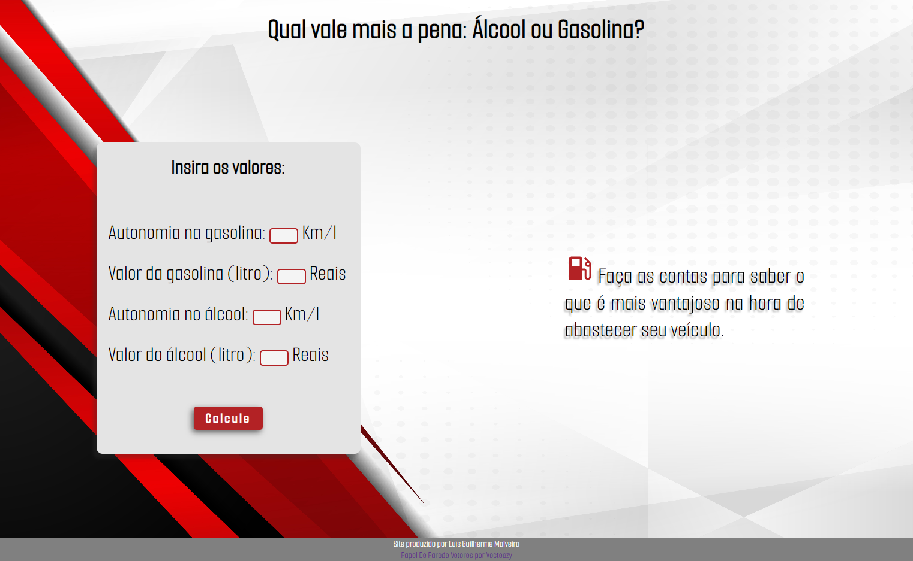

# Cálculo de Combustível

## Bem-Vindo! 👋

Nesse projeto criei uma interface estilizada para calcular qual combustível é mais vantajoso ao abastecer seu carro flex.

## Índice:

- [Visão Geral](#visao-geral)
  - [Deploy](deploy)
  - [Screenshots](#screenshots)
- [Meu processo](#meu-processo)
  - [Feito com](#feito-com)
  - [O que Aprendi](#o-que-aprendi)
- [Autor](#autor)

# Visão Geral

### Deploy

- PROJETO - [Cálculo de combustível](https://luisguilhermemalveira.github.io/Calculo-combustivel/)

### Screenshots
##### Site Desktop

##### Site Mobile  

## Meu processo

### Feito com

- Figma
- HTML5
- Css
- Grid
- Javascript

### O que aprendi

- A manipular o DOM , adicionar e remover classes pelo JavaScript.
- Aprendi fazer variáveis de cores para adicionar ao layout.

## Autor

- GitHub - [Luís Guilherme Theóphilo Malveira](https://github.com/LuisGuilhermeMalveira)
- LinkedIn - [luisguilhermemalveira](https://www.linkedin.com/in/luisguilhermemalveira/)
